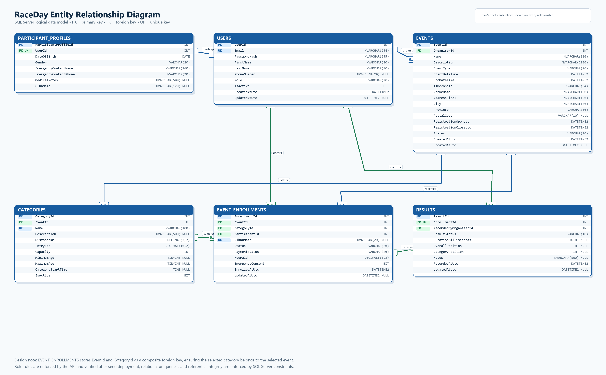
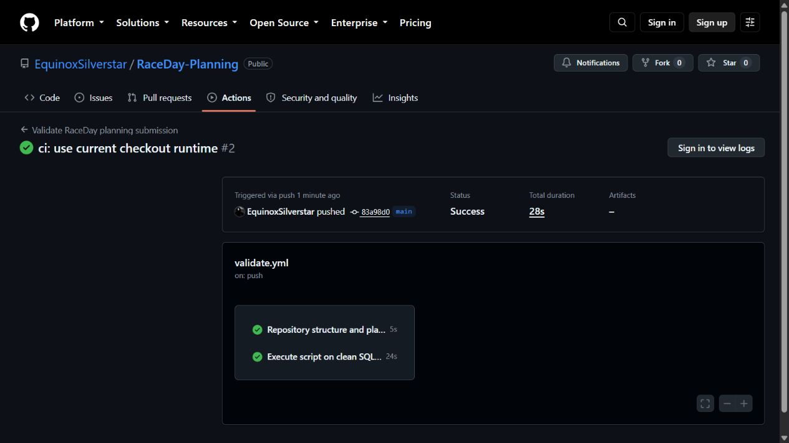

# RaceDay — South African Event Management System

RaceDay is a planned full-stack, web-based event management system for South Africa's road running, walking, and cycling community. It replaces paper registrations, disconnected spreadsheets, and fragmented communication with one place to publish events, choose categories, manage entries, and record official results. This Part 1 repository defines the database and REST API contract that the C# API and MVC application will follow in Parts 2 and 3.

## User roles

### Organiser

An Organiser can create, edit, publish, complete, cancel, and—where safe—delete events they own. They manage event categories, review all enrolments for their events, assign bib numbers and payment states, and capture or correct official participant results. Ownership checks ensure one organiser cannot change another organiser's event data.

### Participant

A Participant can register an account, maintain a personal and emergency-contact profile, browse published events, choose one category when entering an event, view or withdraw their own enrolments, and track their personal result history. Participants cannot access organiser-only management routes or another participant's private enrolment history.

## Planning deliverables

| Deliverable | File | Purpose |
|---|---|---|
| Entity Relationship Diagram | [`docs/raceday-erd.png`](docs/raceday-erd.png) | Six-entity visual model with attributes, keys, relationships, and cardinalities. |
| ERD source | [`docs/raceday-erd.mmd`](docs/raceday-erd.mmd) | Version-controlled Mermaid source for the ERD. |
| API endpoint plan | [`docs/endpoint-plan.md`](docs/endpoint-plan.md) | Route-by-route contract covering method, route, purpose, role, request, response, and failures. |
| SQL Server script | [`docs/raceday-database.sql`](docs/raceday-database.sql) | Creates `RaceDayDb`, tables, keys, constraints, indexes, realistic sample data, and verification checks. |

## Entity Relationship Diagram

The data model contains `Users`, `ParticipantProfiles`, `Events`, `Categories`, `EventEnrollments`, and `Results`. The enrolment design uses a composite foreign key so a selected category must belong to the selected event; unique constraints also prevent duplicate event entry, duplicate event bibs, duplicate emails, and multiple results for one enrolment.

## Run the SQL script in SSMS

Requirements: SQL Server 2019 or later and SQL Server Management Studio (SSMS).

1. Connect SSMS to a clean local SQL Server instance using an account allowed to create databases.
2. Confirm that a database named `RaceDayDb` does not already exist. The script stops safely rather than deleting an existing database.
3. Open [`docs/raceday-database.sql`](docs/raceday-database.sql) in SSMS.
4. Select **Execute**. Keep SQLCMD mode off; the standard `GO` batch separators are supported directly by SSMS.
5. Confirm the final message is `RaceDayDb created and verified successfully.` and the summary row reports 4 users, 3 events, 8 categories, 4 enrolments, and 2 results.

All entity inserts run inside transactions with `XACT_ABORT ON`, and post-deployment checks raise explicit SQL Server errors if seed or role integrity is incorrect.

## CI/CD validation

The GitHub Actions workflow runs on every push and pull request to `main`. It performs two independent checks:

1. validates the required repository files, PNG signature, six SQL entities, endpoint-plan coverage, README content, and minimum 20-commit history; and
2. starts a clean SQL Server 2022 container, executes the complete script with error-stop behaviour, and verifies every seeded row count.

The screenshot below records a successful run in which both the repository-structure job and the clean SQL Server execution job completed with green checks.

[View the successful clean-instance validation run](https://github.com/EquinoxSilverstar/RaceDay-Planning/actions/runs/33537811158).

## Video walkthrough

**Unlisted YouTube video:** [Add the final RaceDay Part 1 walkthrough link before ARC submission](https://youtu.be/REPLACE_WITH_VIDEO_ID)

The recording should use the student's own voice and show the planning documents, explain the ERD and cardinality choices, justify the endpoint plan, run the SQL script live in SSMS, and display the successful output. No AI-generated voice should be used.

## Submission checklist

- [x] ERD PNG stored in `/docs`.
- [x] Endpoint plan stored in `/docs`.
- [x] SQL Server script stored in `/docs`.
- [x] At least 20 meaningful commits.
- [x] GitHub Actions structure and clean SQL Server validation workflow.
- [x] Successful CI/CD screenshot embedded above.
- [ ] Placeholder YouTube link replaced with the unlisted walkthrough URL.
- [ ] Final GitHub repository link submitted on ARC.
